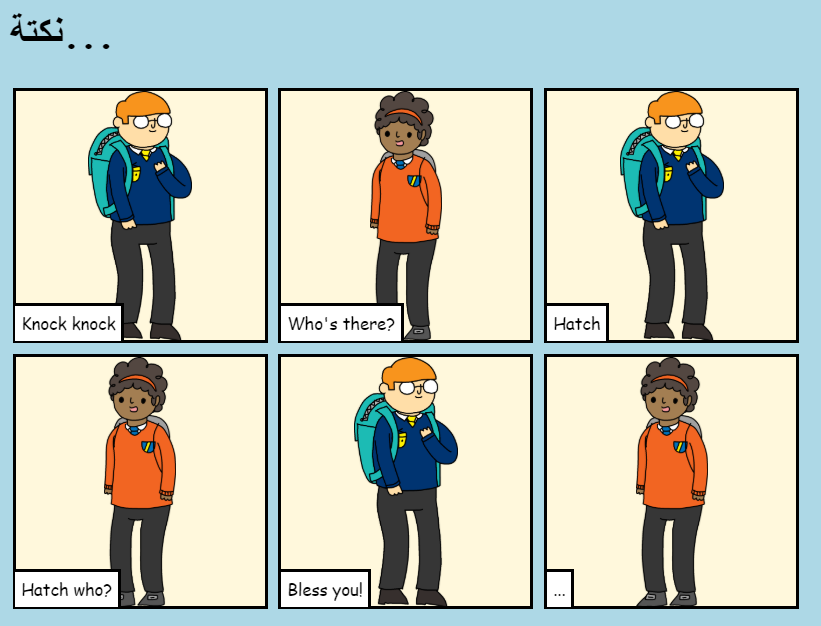

## المقدمة

في هذا المشروع، ستتعلم كيفية إنشاء صفحة الويب الخاصة بك لرواية قصة أو نكتة أو قصيدة.

### ما الذي ستصنعه

انتقل للأسفل في trinket لرؤية العمل النهائي!

  <iframe src="https://trinket.io/embed/html/c8afdef912?outputOnly=true&start=result" width="600" height="450" frameborder="0" marginwidth="0" marginheight="0" allowfullscreen>
  </iframe>
  

### ما الذي ستتعلمه

يتناول هذا المشروع عناصر من معايير المناهج الرقمية الخاصة بـ [Raspberry Pi](http://rpf.io/curriculum){:target="_blank"}:

+ [تصميم الأصول الأساسية ثنائية الأبعاد وثلاثية الأبعاد](https://www.raspberrypi.org/curriculum/design/creator){:target="_blank"}.

### معلومات إضافية للمعلمين

إذا كنت بحاجة إلى طباعة هذا المشروع، فالرجاء استخدام [نسخة متوافقة مع الطابعة](https://projects.raspberrypi.org/en/projects/tell-a-story/print){:target="_blank"} .

استخدم الرابط الموجود في تذييل الصفحة للوصول إلى مستودع GitHub لهذا المشروع، الذي يحتوي على كل الموارد (متضمِّناً مثالاً لمشروع مكتمل) في المجلد 'ar-Sa/resources'.