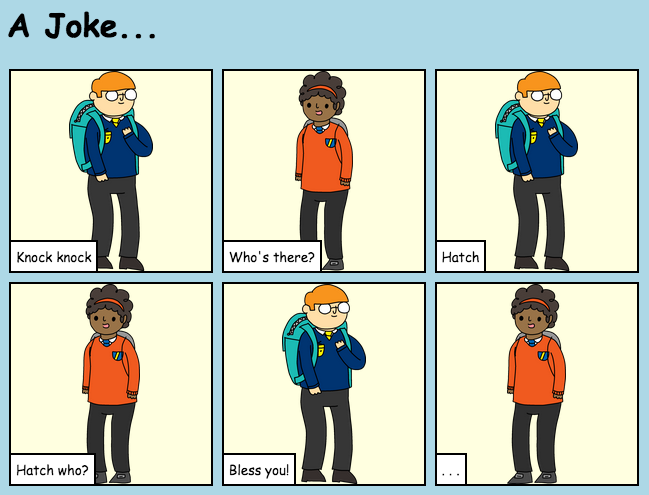

## المقدمة

في هذا المشروع، ستتعلم كيف تنشئ صفحة ويب خاصة بك لتحكي قصة أو نكتة أو قصيدة.

### ما ستصنعه

مرِّر إلى أسفل في trinket لترى الجزء الأخير من النكتة!

  <iframe src="https://trinket.io/embed/html/c8afdef912?outputOnly=true&start=result" width="600" height="450" frameborder="0" marginwidth="0" marginheight="0" allowfullscreen>
  </iframe>
  

### ما ستتعلمه

يتناول هذا المشروع عناصر من الصفوف التالية من [المناهج الرقمية الخاصة بـ Raspberry Pi](http://rpf.io/curriculum){:target="_blank"}:

+ [الأصول الأساسية للتصميمات ثنائية الأبعاد وثلاثية الأبعاد](https://www.raspberrypi.org/curriculum/design/creator){:target="_blank"}.

### معلومات إضافية للمعلمين

إذا كنت بحاجة إلى طباعة هذا المشروع، فيُرجى استخدام [نسخة سهلة الطباعة](https://projects.raspberrypi.org/en/projects/tell-a-story/print){:target="_blank"} .

استخدم الرابط الموجود في تذييل الصفحة للوصول إلى مستودع GitHub لهذا المشروع، الذي يحتوي على كل الموارد (ومنها مثال لمشروع مكتمل) في المجلد 'en/resources'.
