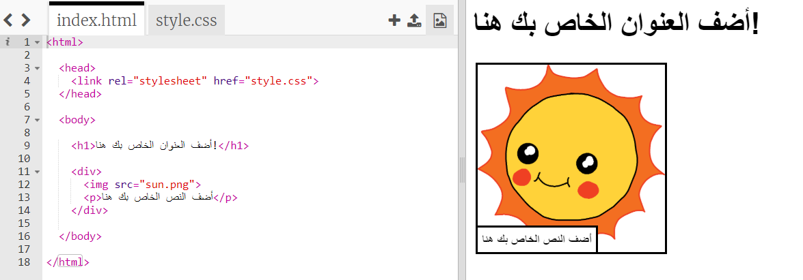
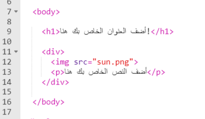
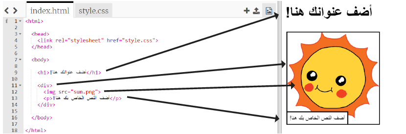

## تحرير قصتك

لنبدأ بتحرير محتوى HTML ونمط CSS لصفحة الويب الخاصة بالقصة.

+ افتح [هذا الـ trinket](https://trinket.io/html/a336221062){:target="_blank"}.

يجب ان يبدو المشروع مثل هذا:

محتوى صفحة الويب يوضع في القسم `<body>` من `index.html` في مستند HTML.

+ ابحث عن محتوى صفحة الويب من السطر 7 فصاعدًا، داخل علامات التبويب`<body>` و `</body>`.

+ حاول معرفة العلامات التي يتم استخدامها لإنشاء الأجزاء المختلفة من صفحة الويب.

--- collapse ---
---
title: الإجابة
---

+ `<h1>` هو **عنوان**. يمكنك استخدام الأرقام من 1 إلى 6 لإنشاء عناوين بأحجام مختلفة.
+ `
` هو اختصار لـ **division** أي التقسيم ، وهو وسيلة لتجميع الأشياء معًا. في صفحة الويب هذه، ستستخدمه لتجميع كل العناصر معًا لكل جزء من قصتك.
+ `` هي **صورة**.
+ `
` هي **فقرة** من النص.

--- /collapse ---