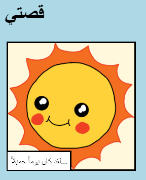

\--- challenge \---

## تحدي: قم ببعض التغييرات

قم بتحرير كود HTML و CSS لتخصيص صفحة الويب الخاصة بك.

يمكن العثور على محتوى HTML في الملف `index.html`، ونمط CSS في الملف `style.css`.

يمكنك أيضًا تغيير الألوان المستخدمة في صفحة الويب، ويمكنك استخدام خطوط مختلفة مثل:

+ Arial
+ Comic Sans MS
+ Impact
+ Tahome

يمكنك العثور على المزيد من أسماء ألوان CSS [هنا](http://jumpto.cc/colours){:target="_blank"}.

\--- /challenge \---