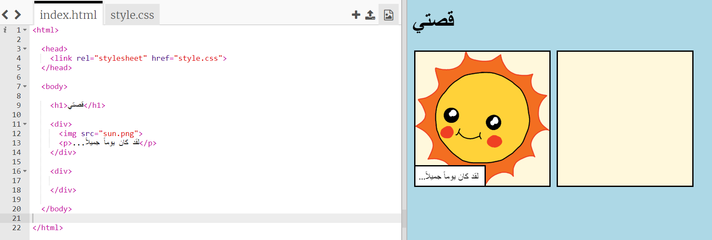
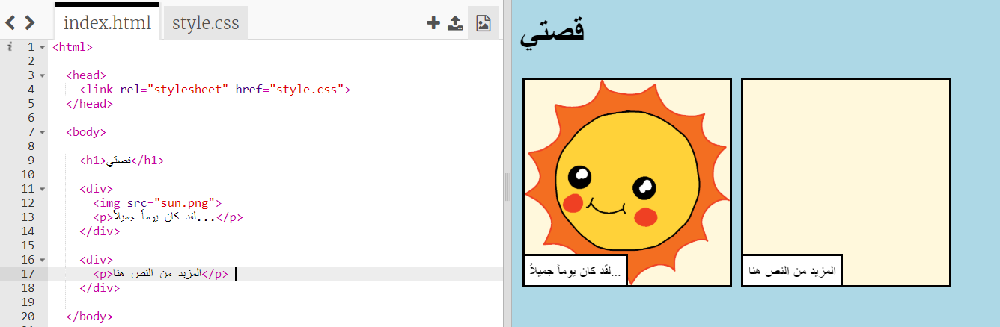
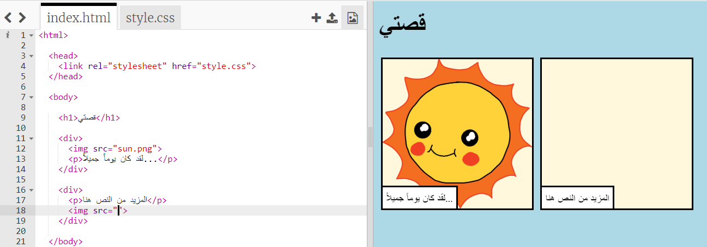
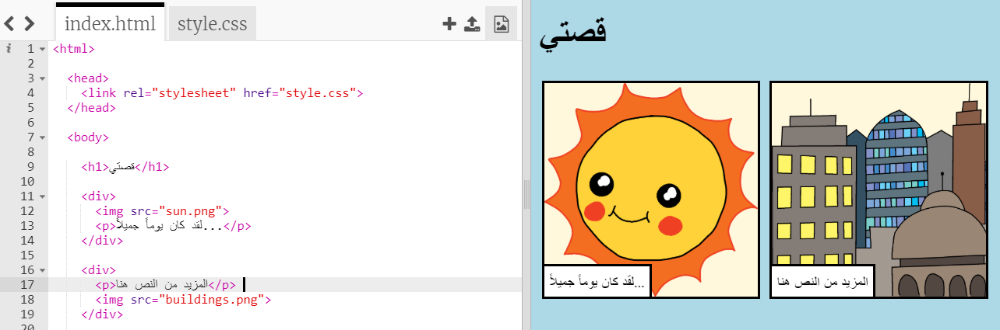

## رواية قصتك

دعنا نضيف جزء ثاني لقصتك.

+ انتقل إلى السطر 15 من التعليمات البرمجية، وقم بإضافة مجموعة أخرى من `<div>` و ` </div>` علامات البداية والنهاية. سيؤدي هذا إلى إنشاء صندوق جديد للجزء التالي من قصتك.



+ أضف فقرة من النص داخل العلامة `<div>` الجديدة:

```html
<p>المزيد من النص هنا!</p>
```



+ يمكنك عرض صورة في صندوقك الجديد عن طريق إضافة هذا الكود في العلامة `<div>` الخاصة بك:

```html

```



لاحظ أن العلامات `` مختلفة قليلاً عن العلامات الأخرى: لا تحتوي على علامة نهاية.

+ لجعل صورة تظهر، عليك إضافة **المصدر** (`src`) من الصورة داخل علامات الاقتياس.

انقر على أيقونة الصورة لرؤية الصور المتاحة لقصتك.


+ اختر الصورة التي تريد إضافتها وتذكر اسمها، مثلاً `buildings.png`.

+ انقر على ` index.html ` للعودة إلى تعليماتك البرمجية.


+ أضف اسم الصورة بين علامات الاقتباس في العلامة ``.

```html

```

