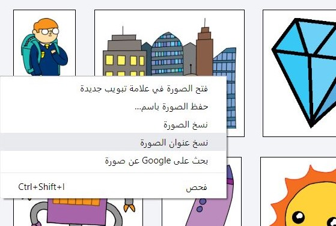
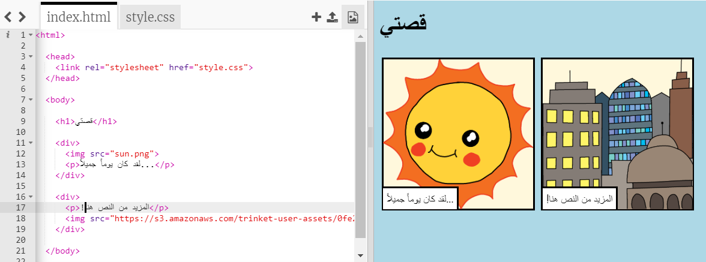

## العثور على الصور الخاصة بك

لنجد صورة على الويب لإضافتها إلى قصتك.

+ انتقل إلى [هذه الصفحة](http://jumpto.cc/html-images){: target = "_ blank"}، وابحث عن صورة تريد إضافتها في قصتك.

+ انقر بزر الماوس الأيمن على الصورة، وانقر على **نسخ عنوان URL للصورة** (أو **نسخ عنوان الصورة**، اعتماداً على الكمبيوتر الذي تستخدمه). عنوان URL هو عنوان الصورة.

+ ارجع إلى الصفحة `index.html` الخاصة بك.

+ الصق عنوان URL بين علامات الكلام في العلامة ``. يجب أن ترى صورتك تظهر!

