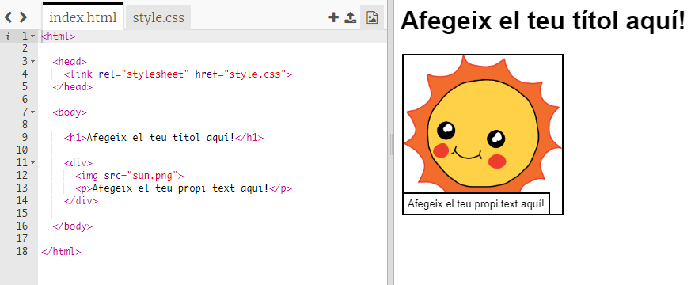

## Editant la teva història

Comencem per l’edició del contingut HTML i l’estil CSS de la pàgina web de la història.

+ Obre [ aquest Trinket](http://jumpto.cc/web-story) {:target ="_ blank"}.

El teu projecte hauria de ser així:

El contingut de la pàgina web inserta'l a la secció `<body>` del document HTML `index.html`.

+ Cerca el contingut de la pàgina web des de la línia 7 en endavant, dins de les etiquetes `<body>` i `</body>`.

+ Mira si pots esbrinar quines etiquetes s’utilitzen per crear les diferents parts de la pàgina web.

## \--- collapse \---

## títol: Resposta

+ `<h1>` és un **encapçalament**. Pots fer servir els números 1 a 6 per crear encapçalaments de diferents mides.
+ `
` és una etiqueta abreviada de **divisió** i és una manera d'agrupar les coses. En aquesta pàgina web, la utilitzaràs per agrupar totes les coses de cada part de la teva història.
+ `` és una **imatge**.
+ `
` és un **paràgraf** de text.

\--- /collapse \---