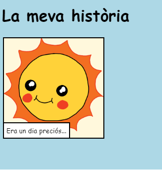

\--- challenge \---

## Repte: fes alguns canvis

Edita el codi HTML i CSS per personalitzar la teva pàgina web.

El contingut HTML es troba al fitxer `index.html` i l'estil CSS al fitxer `style.css`.

També pots modificar els colors utilitzats a la pàgina web i utilitzar diferents tipus de lletra com:

+ Arial
+ Còmic Sans MS
+ Impact
+ Tahoma

Troba més noms de color CSS [aquí](http://jumpto.cc/colours) {:target="_ blank"}.

\--- /challenge \---