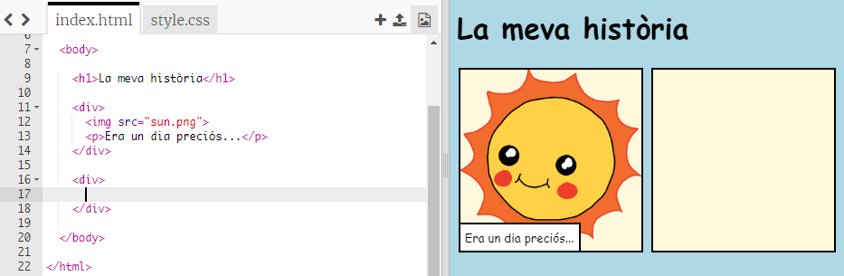
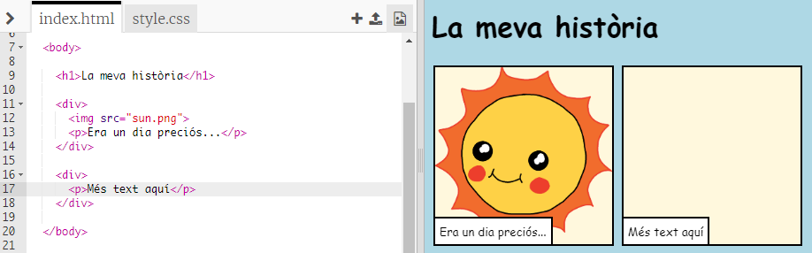
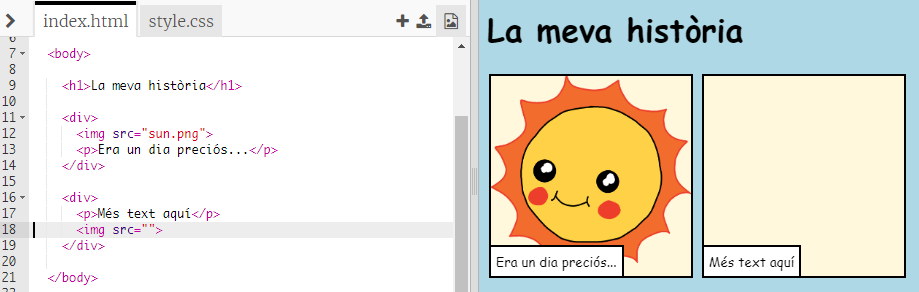
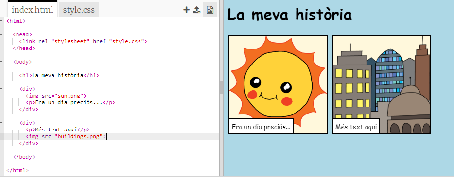

## Explicant la teva història

Afegirem ara una segona part a la teva història.

+ Ves a la línia 15 del codi i afegeix un altre conjunt d'etiquetes `<div>` i `</div>` d’inici i final. D’aquesta manera es crearà un requadre nou per a la següent part de la teva història.



+ Afegeix un paràgraf de text dins l'etiqueta nova `<div>`:

```html
<p>Més text aquí!</p>
```



+ Pots visualitzar una imatge al requadre nou afegint aquest codi a dins de la teva etiqueta `<div>`:

```html

```



Observa que les etiquetes `` són una mica diferents de les altres etiquetes: no tenen una etiqueta final.

+ Per tal que es mostri una imatge, has d'afegir la **font** (`src`) de la imatge dins de les cometes.

Fes clic a la icona imatge per veure les imatges disponibles per a la teva història.


+ Decideix quina imatge vols afegir i recorda el seu nom, per exemple `buildings.png`.

+ Fes clic a `index.html` per tornar al teu codi.


+ Afegeix el nom de la imatge entre les cometes de la teva etiqueta ``.

```html

```

