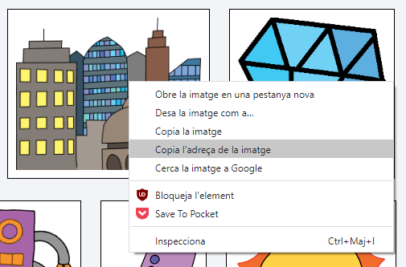
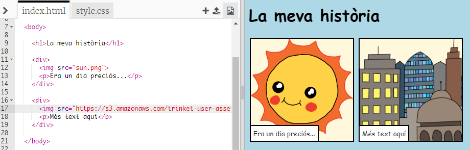

## Trobant les teves imatges

Anem a trobar una imatge a la web per afegir a la teva història.

+ Ves a [aquesta pàgina](http://jumpto.cc/html-images){:target="_blank"} i troba una imatge que vulguis incloure a la teva història.

+ Fes clic amb el botó dret a la imatge i clica **Copia la URL de la imatge** (o **Copia l'adreça de la imatge**, segons l’ordinador que facis servir). L’URL és l’adreça de la imatge.

+ Torna a la teva pàgina `index.html`.

+ Enganxa la URL entre les cometes de la teva etiqueta ``. Hauries de veure aparèixer la teva imatge!

