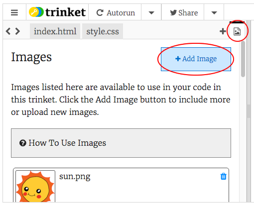

## Carregant imatges

**Si tens un compte Trinket**, també pots penjar les teves pròpies imatges a la pàgina web.

+ Fes clic a la icona de la imatge que es troba a la part superior de la teva pàgina a Trinket, i després fes clic a **Image Library** (biblioteca d'imatges).



+ Fes clic al botó **Upload New Image** (carrega nova imatge) i, a continuació, busca la imatge que vols fer servir al teu ordinador i arrossega-la al quadre. Alternativament, utilitza el botó per seleccionar-lo.


+ Ara afegeix el nom de la teva nova imatge entre les cometes de la teva etiqueta ``, així:

```html

```