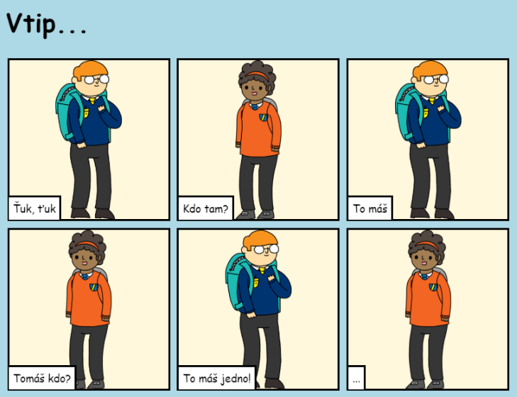

## Úvod

V tomto projektu se naučíš, jak vytvořit svoji vlastní webovou stránku, na které ukážeš svůj příběh, vtip nebo báseň.

### Co budeš dělat

Roluj v trinketu dolů a uvidíš pointu vtipu!

  <iframe src="https://trinket.io/embed/html/c8afdef912?outputOnly=true&start=result" width="600" height="450" frameborder="0" marginwidth="0" marginheight="0" allowfullscreen>
  </iframe>
  

### Co se naučíš

This project covers elements from the following strands of the [Raspberry Pi Digital Making Curriculum](https://rpf.io/curriculum){:target="_blank"}:

+ [Designovat základní 2D a 3D prvky](https://www.raspberrypi.org/curriculum/design/creator){:target="_blank"}.

### Dodatečné informace pro učitele

Potřebujete-li tento projekt vytisknout, použijte verzi [pro tisk](https://projects.raspberrypi.org/en/projects/tell-a-story/print){:target="_blank"} .

Pomocí odkazu v zápatí získáte přístup k úložišti GitHub tohoto projektu, které obsahuje všechny zdrojové kódy (včetně příkladu dokončeného projektu) ve složce „en/resources“.