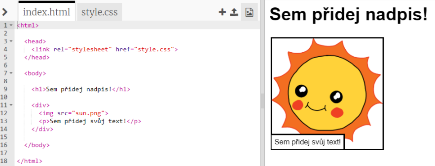
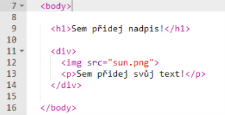
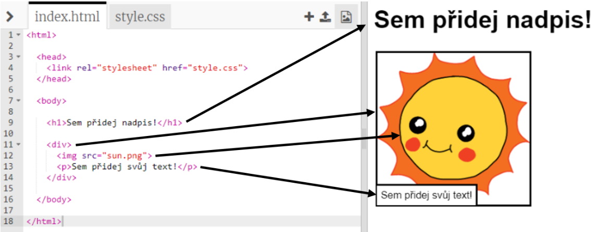

## Úprava tvého příběhu

Pojďme začít úpravou obsahu v HTML a stylů v CSS tvé webové stránky.

+ Otevři [tento trinket](http://jumpto.cc/web-story){:target="_blank"}.

Projekt by měl vypadat přibližně takto:

Obsah webové stránky se píše do sekce `<body>`v HTML dokumentu `index.html`.

+ Najdi obsah webové stránky od řádku 7 uvnitř tagů `<body>` a `</body>`.

+ Schválně jestli přijdeš na to, které tagy se používají pro vytvoření různých částí webové stránky.

## \--- collapse \---

## title: Odpověď

+ `<h1>` je **nadpis**. Můžeš použít čísla od 1 do 6 pro vytvoření nadpisů různých velikostí.
+ `
` je zkratka pro **oddíl** a používá se pro seskupování věcí. Na této webové stránce ji použiješ pro seskupení všech věcí z jedné části tvého příběhu.
+ `` je **obrázek**.
+ `
` je **odstavec**.

\--- /collapse \---