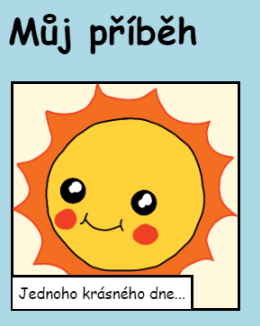

\--- challenge \---

## Výzva: pozměň pár věcí

Uprav HTML a CSS kód a přizpůsob svoji stránku.

HTML obsah nalezneš v souboru `index.html` a CSS styly zase v souboru `style.css`.

Také můžeš na webové stránce změnit barvy a použít různá písma jako:

+ Arial
+ Comic Sans MS
+ Impact
+ Tahoma

Více názvů pro CSS barvy nalezneš [zde](http://jumpto.cc/colours){:target="_blank"}.

\--- /challenge \---