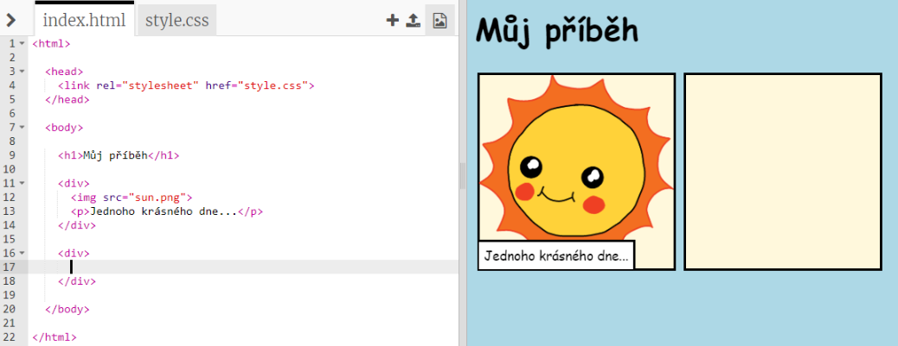
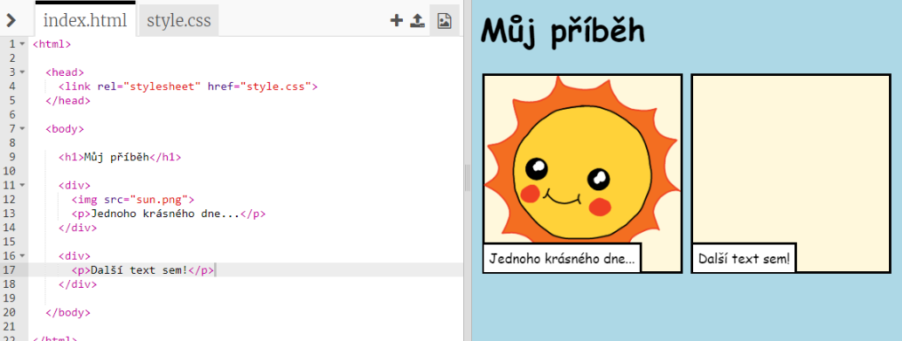
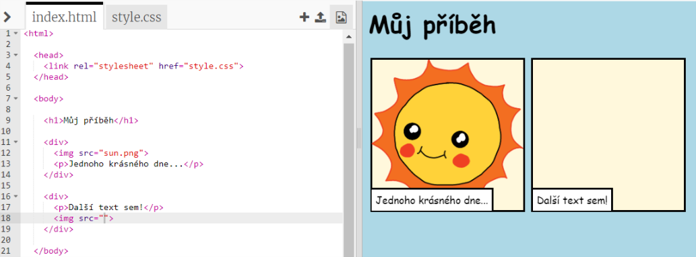
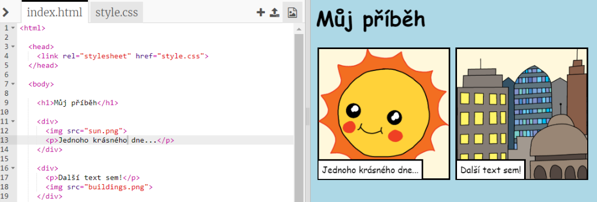

## Vyprávění tvého příběhu

Pojďme přidat druhou část tvého příběhu.

+ V kódu přejdi na řádek 15 a přidej další počáteční a koncový tag `<div>` a `</div>`. Tohle vytvoří nový rámeček pro další část tvého příběhu.



+ Přidej odstavec do nového tagu `<div>`:

```html
<p>Více textu zde!</p>
```



+ Do nového rámečku můžeš vložit obrázek přidáním tohoto kódu do tagu `<div>`:

```html

```



Všimni si, že tagy `` jsou trochu jiné než ostatní tagy: nemají koncový tag.

+ Aby se ti obrázek zobrazil, budeš muset přidat **umístění** (`src`) obrázku do uvozovek.

Klikni na ikonu obrázku pro zobrazení obrázků, které jsou pro tvůj příběh dostupné.


+ Rozhodni se, který obrázek chceš přidat a zapamatuj si jeho jméno, například `buildings.png`.

+ Klikni na `index.html` a vrať se zpátky do svého kódu.


+ Přidej název obrázku mezi uvozovky do tagu ``.

```html

```

