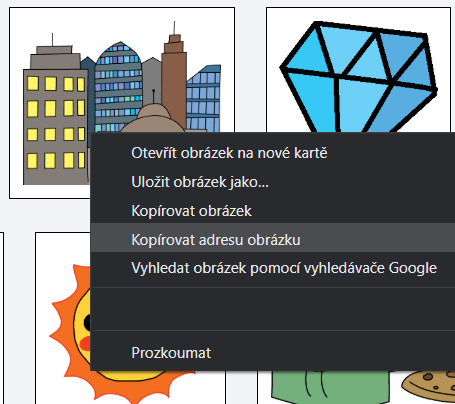
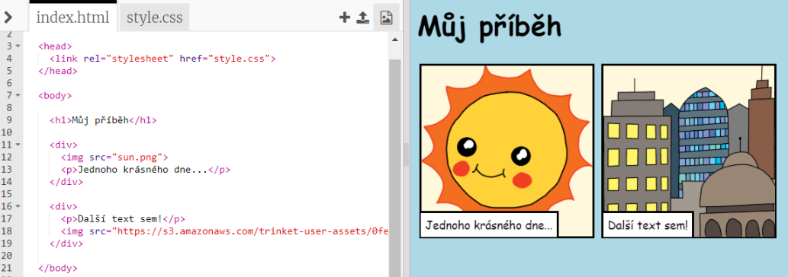

## Nalezení tvých obrázků

Pojďme najít obrázky na webu, které do svého příběhu přidáš.

+ Přejdi na [tuto stránku](http://jumpto.cc/html-images){:target="_blank"} a najdi obrázek, který chceš do svého příběhu přidat.

+ Pravým tlačítkem myši klikni na obrázek a klikni na **Kopírovat URL adresu obrázku** (nebo **Kopírovat adresu obrázku**, záleží na tom, jaký počítač používáš). URL je adresa daného obrázku.

+ Přejdi zpět na svou stránku `index.html`.

+ Vlož URL mezi uvozovky tagu ``. Tvůj obrázek by se měl teď ukázat!

