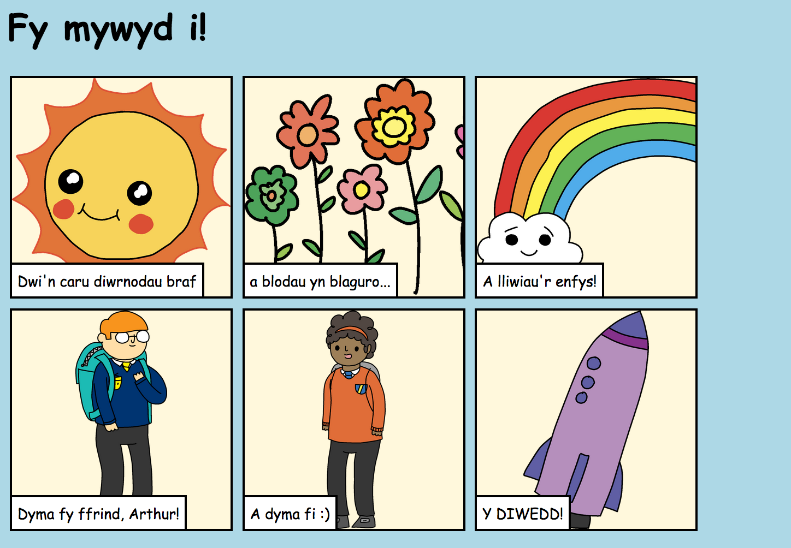

## Cyflwyniad

Yn y prosiect yma, fyddi di'n dysgu sut i greu tudalen gwe i adrodd stori, jôc neu gerdd.

### Beth fyddi di'n ei wneud

Cer i waelod y 'trinket' i weld diwedd y stori!

  <iframe src="https://trinket.io/embed/html/d1aee959ab?outputOnly=true&start=result" width="600" height="450" frameborder="0" marginwidth="0" marginheight="0" allowfullscreen>
  </iframe>
  

### Beth fyddi di'n ei ddysgu

Mae'r prosiect yma yn cynnwys elfennau o'r adrannau canlynol o [Gwricwlwm Creu Digidol Raspberry Pi](http://rpf.io/curriculum){:target="_blank"}:

+ [Dylunio elfennau sylfaenol 2D a 3D](https://www.raspberrypi.org/curriculum/design/creator){:target="_blank"}.

### Gwybodaeth ychwanegol i addysgwyr 

Os oes angen i ti argraffu'r prosiect yma, defnyddiwch y [fersiwn i'w argraffu](https://projects.raspberrypi.org/cy-GB/projects/tell-a-story/print){:target="_blank"} .

Defnyddiwch y ddolen ar waelod y dudalen i gael mynediad i GitHub y prosiect, sydd yn cynnwys yr holl adnoddau (gan gynnwys enghraifft o'r prosiect gorffenedig) yn y ffeil 'cy-GB/resources'.

