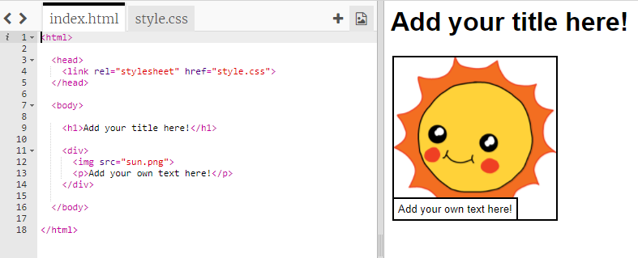
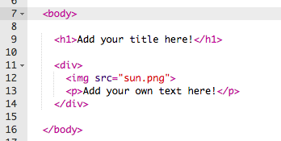

## Golygu dy stori

Fe wnawn ni ddechrau trwy olygu'r cynnwys HTML a steil CSS y stori.

+ Agora'r [trinket yma](https://trinket.io/html/6af9bbfc99){:target="_blank"}.

Fe ddylai'r prosiect edrych fel hyn:

Mae cynnwys y dudalen gwe yn mynd yn ardal `<body>` yr `index.html` yn y ddogfen HTML.

+ Chwilio am gynnwys y dudalen gwe o linell 7 ymlaen, o fewn y tagiau `<body>` a `</body>`.

+ Wyt ti'n gallu adnabod pa dagiau sy'n cael eu defnyddio i greu gwahanol rannau o'r dudalen gwe?

--- collapse ---
---
title: Ateb
---

+ `<h1>` yw __pennawd__ neu __heading__. Mae modd i ti ddefnyddio rhifau 1 i 6 i greu penawdau o wahanol feintiau. 
+ `
` yw __adran__ ac mae'n fyw am y gair Saesneg __division__.  Mae'n ffordd o grwpio pethau gyda'i gilydd.  Yn y dudalen gwe yma, fe fyddi di'n ei ddefnyddio i grwpio yr holl elfennau ar gyfer pob rhan o dy stori.
+ `` yw __llun__ neu __image__.
+ `
` yw __paragraff__ o destun.

--- /collapse ---
