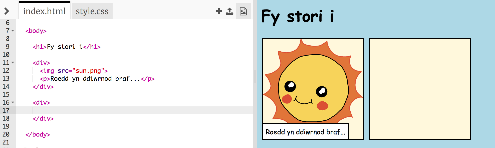
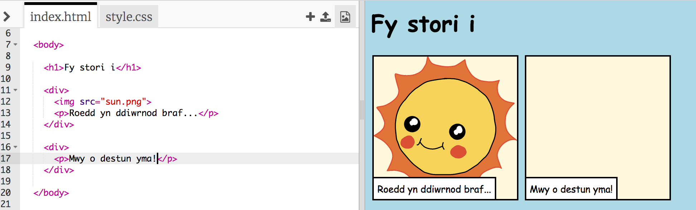
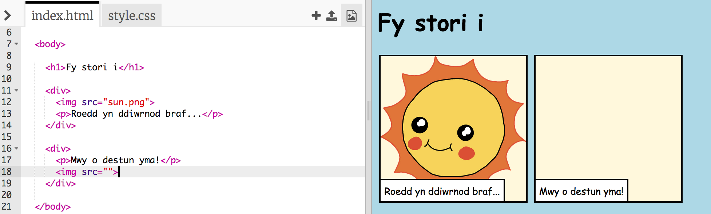
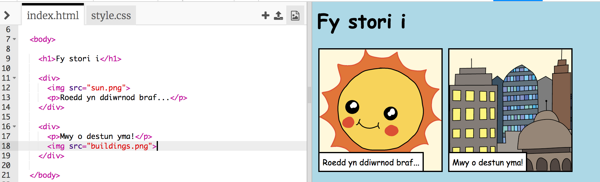

## Dweud dy stori

Fe wnawn ni ychwanegu ail ran i dy stori.

+ Chwilia am linell 15 o'r côd ac ychwanegu set arall o dagiau ar y dechrau a diwedd, `<div>` a `</div>`.  Bydd hyn yn creu bocs newydd ar gyfer rhan nesaf dy stori.



+ Ychwanega paragraff o destun yn y tag `<div>`:

```html
<p>Mwy o destun yma!</p>
```



+ Mae modd cynnwys llun yn y bocs newydd trwy ychwanegu'r côd yma yn y tag `<div>`:

```html

```



Sylwa fod y tag `` ychydig yn wahanol i dagiau arall: does dim tag ar y diwedd.

+ I arddangos llun bydd angen ychwanegu **tarddiant** neu **source** (`src`) y llun tu fewn y dyfynodau.

Clicia eicon y llun i weld y lluniau sydd ar gael ar gyfer dy stori.


+ Penderfyna pa lun hoffet ti ei ychwanegu a cofia ei enw, er enghraifft `buildings.png`.

+ Clicia `index.html` i ddychwelyd at dy gôd.


+ Ychwanega enw'r llun rhwng y dyfynodau yn y tag ``.

```html

```


