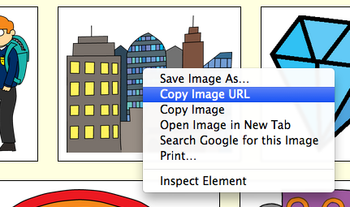
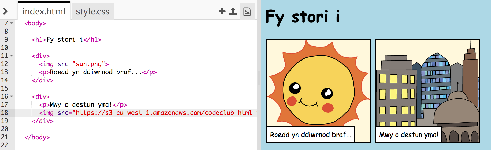

## Dod o hyd i luniau

Beth am ddod o hyd i luniau ar y we i ychwanegu at dy stori.

+ Cer i'r [dudalen yma](http://jumpto.cc/html-images){:target="_blank"}, a dod o hyd i lun rwyt ti eisiau ei gynnwys yn dy stori. 

+ Gwna clic-dde ar y llun a chlicio **Copy Image URL** (neu **Copy Image Address** yn dibynnu ar y cyfrifiadur). Yr URL yw cyfeiriad y llun.

+ Cer yn ôl i dy dudalen `index.html`.

+ Mewnbyna'r URL rhwng y dyfynodau yn y tag ``. Fe ddylet ti weld y llun yn ymddangos!

