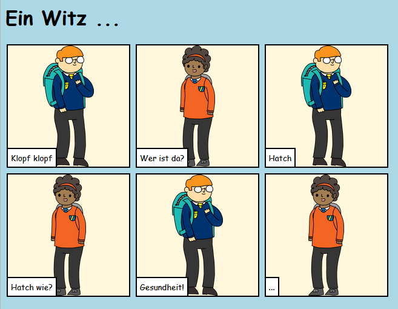

## Einleitung

In diesem Projekt wirst du lernen, eine eigene Webseite zu erstellen um eine Geschichte, einen Witz oder ein Gedicht zu erzählen.

### Was du machen wirst

Scroll im trinket nach unten um die Pointe zu sehen!

  <iframe src="https://trinket.io/embed/html/7aa9738db1?outputOnly=true&start=result" width="600" height="450" frameborder="0" marginwidth="0" marginheight="0" allowfullscreen>
  </iframe>
  

### Was du lernen wirst

Dieses Projekt umfasst Elemente aus den folgenden Themen des [Raspberry Pi Digital Making Lehrplans](http://rpf.io/curriculum) {:target="_blank"}:

+ [Entwurf von grundlegenden 2D- and 3D-Konstruktionen](https://www.raspberrypi.org/curriculum/design/creator){:target="_blank"}.

### Zusätzliche Informationen für Pädagogen

Wenn Sie dieses Projekt ausdrucken möchten, verwenden Sie bitte die [druckerfreundliche Version](https://projects.raspberrypi.org/de-DE/projects/tell-a-story/print){:target="_blank"}.

Verwenden Sie den Link in der Fußzeile, um auf das GitHub-Repo für dieses Projekt zuzugreifen. Dieses enthält alle Ressourcen (einschließlich eines Beispiels für ein abgeschlossenes Projekt) im Ordner "de-DE/resources".