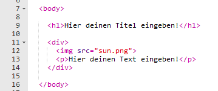

## Die Geschichte bearbeiten

Lass uns damit beginnen, den HTML Inhalt und CSS Stil der Geschichten-Webseite zu bearbeiten.

+ Dieses Trinket öffnen: <a href="http://jumpto.cc/web-story" target="_blank">jumpto.cc/web-story</a>. 

	Das Projekt sollte so aussehen:
	
	

+ Du wirst dich vielleicht noch an das 'Happy Birthday' Projekt erinnern: Der Webseiteninhalt kommt in den `<body>` (Body, bzw. Hauptteil) des HTML Dokuments.

	Gehe zu Zeile 7 des Codes und du solltest den Webseiteninhalt, der sich in den `<body>` und den `</body>` Tags befindet, sehen können.

	

+ Kannst du unterscheiden, welche Tags benutzt werden, um die verschiedenen Komponente der Webseite zu erstellen?

	

	+ `<h1>` ist eine __Überschrift__. Du kannst die Zahlen von 1 bis 6 benutzen, um Überschriften in unterschiedlichen Größen zu erstellen;
	+ `
` ist eine Abkürzung für __Division__ (bzw. Teilung) und ist eine Methode, um Dinge zusammen zu gruppieren. Bei dieser Webseite wirst du es benutzen, um alle Dinge für jeden Aspekt deiner Geschichte zusammen zu gruppieren;
	+ `` ist ein __Bild__ (bzw. „Image“);
	+ `
` ist ein __Absatz__ (bzw. „Paragraph“) von Text.
