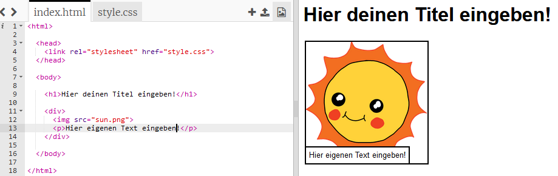
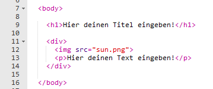
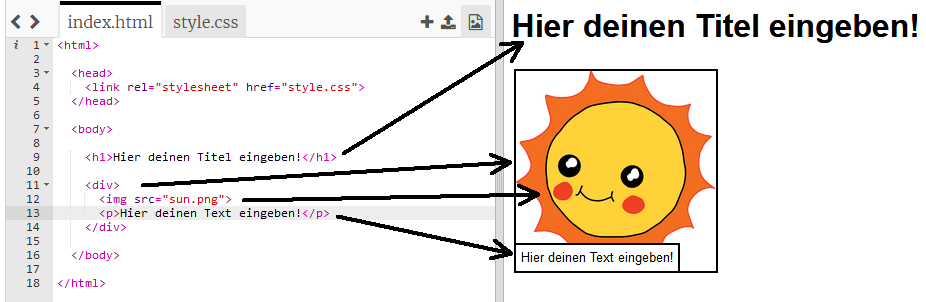

## Erstell deine Geschichte

Beginnen wir damit, den HTML-Inhalt und den CSS-Stil der Webseite der Story zu bearbeiten.

+ Öffne [dieses trinket](http://jumpto.cc/web-story){:target="_blank"}.

Das Projekt sollte so aussehen:

Der Inhalt der Webseite wird in den Abschnitt `<body>` von ` index.html` vom HTML-Dokument aufgenommen.

+ Suche den Inhalt der Webseite ab Zeile 7 innerhalb von `<body>` und ` </body>` Marken.

+ Versuche herauszufinden, welche Marken benutzt werden, um die unterschiedlichen Teile der Webseite zu erstellen.

## \--- collapse \---

## title: Antwort

+ `<h1>` ist eine **Überschrift**. Du kannst die Zahlen 1 bis 6 verwenden, um Überschriften unterschiedlicher Größe zu erstellen.
+ `
` steht für **Division** und ist eine Möglichkeit, Dinge zusammenzufassen. Auf dieser Webseite kannst du es benutzen, um alle Elemente deiner Geschichte zusammenzufassen.
+ `` ist ein **Bild**.
+ `
` ist ein **Absatz** mit Text.

\--- /collapse \---