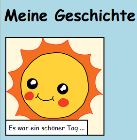
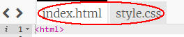

\--- challenge \---

## Aufgabe: mach ein paar Änderungen

Bearbeite den HTML- und CSS-Code, um deine Webseite anzupassen.

Die HTML-Inhalte findest du in der `index.html` Datei und die CSS-Style in der `style.css` Datei.

Du kannst auch die auf der Webseite verwendeten Farben ändern und verschiedene Schriftarten verwenden, z. B.:

+ Arial
+ Comic Sans MS
+ Impact
+ Tahoma

Du findest weitere CSS-Farbnamen [hier](http://jumpto.cc/colours){:target="_blank"}.

\--- /challenge \---