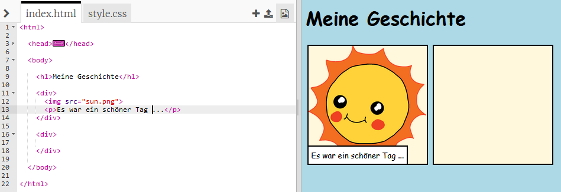

## Eine Geschichte erzählen

Lass uns einen zweiten Teil zu deiner Geschichte hinzufügen.

+ Gehe zu Zeile 15 des Codes und füge ein weiteres Set von `<div>` und `</div>` Start- und End-Tags hinzu. Dies erstellt ein neues Kästchen für den nächsten Teil deiner Geschichte.

	

+ Füge einen Textabsatz innerhalb deines neuen `<div>` Tags hinzu.

	```
	<p>Noch mehr Text hier!</p>
	```

	

+ Zum Schluss kannst du ein Bild zu deinem neuen Kästchen hinzufügen, indem du diesen Code innerhalb deines `<div>` Tags hinzufügst:

	```
	
	```

	

	Beachte bitte, dass die `` Tags etwas anders als die anderen Tags sind, weil sie keinen End-Tag besitzen.

+ Bei HTML Bildern musst du die __Quelle__ des Bildes innerhalb der Anführungszeichen hinzufügen. 

	Klicke auf das Bildsymbol, um zu sehen, welche Bilder dir für deine Geschichte zur Verfügung stehen.

	

+ Finde den Namen eines Bildes, das du hinzufügen möchtest, z. B. `buildings.png` (Gebäude). Du kannst dann auf `index.html` klicken, um wieder zurück zu deinem Code zu gelangen.

	

+ Du kannst dann den Namen des Bildes zwischen den Anführungszeichen in deinem `` Tag hinzufügen.

	```
	
	```

	
