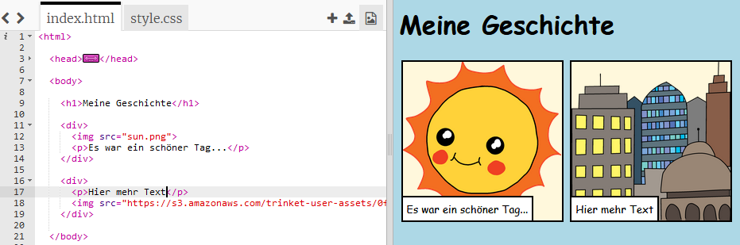

## Finde deine eigenen Bilder

Lass uns ein Bild aus dem Internet finden, um es zu deiner Geschichte hinzuzufügen.

+ Gehe zu <a href="http://jumpto.cc/html-images" target="_blank">jumpto.cc/html-images</a> und finde ein Bild, das du mit in deine Geschichte einbeziehen möchtest.

+ Klicke mit der rechten Maustaste auf das Bild und klicke auf 'Copy image URL' (Bild URL kopieren). Das __URL__ ist die Bildadresse.

	

+ Füge das URL zwischen den Anführungszeichen in deinem `` Tag ein. Du solltest jetzt sehen können, wie dein Bild erscheint!

	
