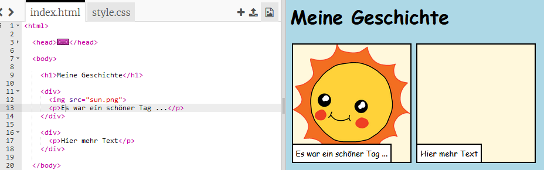

## Erzähl deine Geschichte

Füge einen zweiten Teil zu deiner Geschichte hinzu.

+ Gehe zur Zeile 15 des Codes und füge einen weiteres Paar von `<div>` und ` </div>` Start- und End-Tags hinzu. Dadurch wird eine neue Box für den nächsten Teil deiner Geschichte erstellt.


+ Füge einen Textabschnitt in dein neues `<div>` -Tag ein:

```html
<p>Mehr Text hier!</p>
```



+ Du kannst ein Bild in deiner neuen Box anzeigen, indem du diesen Code in den `<div>` -Tag einfügst:

```html

```


Beachte, dass `` -Tags sich ein wenig von anderen Tags unterscheiden: Sie haben kein End-Tag.

+ Damit ein Bild angezeigt wird, musst du die **Quelle** des Bildes (`src`) innerhalb der Sprachmarken hinzufügen.

Klicke auf das Bildsymbol, um die für deine Geschichte verfügbaren Bilder anzuzeigen.


+ Lege fest, welches Bild du hinzufügen möchtest, und merke dir dessen Namen, beispielsweise ` buildings.png `.

+ Klicke auf ` index.html ` um zu deinem Code zurückzukehren.


+ Füge den Namen des Bildes zwischen den Sprachmarken in deinem `` -Tag hinzu.

```html

```

