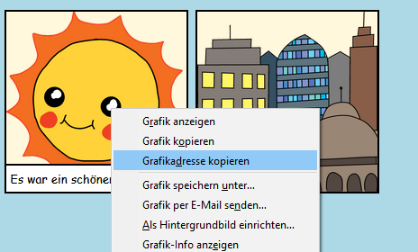
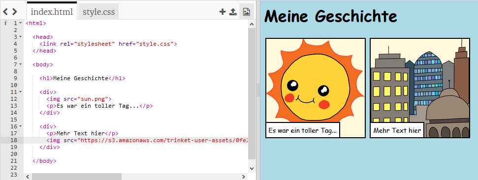

## Suche eigene Bilder

Lass uns im Web ein Bild finden, um es deiner Geschichte hinzuzufügen.

+ Gehe zu [dieser Seite](http://jumpto.cc/html-images){:target="_blank"} und finde ein Bild, das du in deine Geschichte aufnehmen möchtest.

+ Klicke mit der rechten Maustaste auf das Bild und klicke auf **Bild-URL kopieren** (oder **Bildadresse kopieren**, abhängig vom verwendeten Computer). Die URL ist die Adresse des Bildes.

+ Gehe zurück zu deiner `index.html` Seite.

+ Füge die URL zwischen den Sprachmarken in deinem `` -Tag ein. Du solltest das Bild jetzt sehen können!

