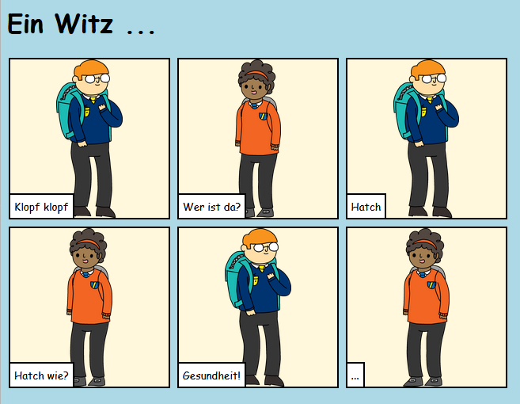

--- challenge ---

## Aufgabe: mach weiter!

Nutze das, was du in diesem Projekt gelernt habst, um deine Geschichte zu erzählen! Hier ist ein Beispiel:

--- /challenge ---

Von der Community übersetzt

Dieses Projekt wurde von **Martin Ruhle** übersetzt und von **Julien de Boer** überprüft.

Unsere großartigen Freiwilligen helfen uns, Kindern auf der ganzen Welt die Möglichkeit zu geben, coden zu lernen. Sie können uns helfen, mehr Kinder zu erreichen, indem Sie unsere Projekte übersetzen - lesen Sie mehr unter [rpf.io/translate](https://rpf.io/translate).