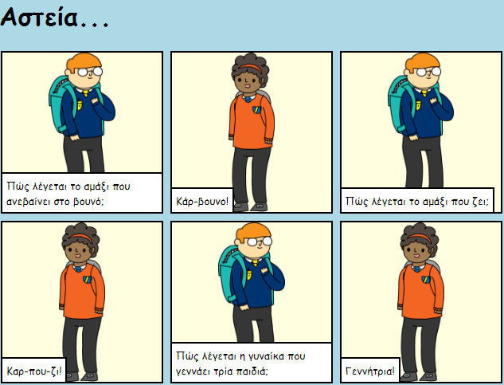

## Εισαγωγή

Σε αυτό το έργο, θα μάθεις πώς να φτιάξεις τη δική σου ιστοσελίδα για να πεις μια ιστορία, ένα αστείο ή ένα ποίημα.

### Τι θα φτιάξεις

Μετακινήσου προς τα κάτω στο trinket για να δεις το αστείο τελείωμα των ανέκδοτων!

  <iframe src="https://trinket.io/embed/html/c8afdef912?outputOnly=true&start=result" width="600" height="450" frameborder="0" marginwidth="0" marginheight="0" allowfullscreen>
  </iframe>
  

### Τι θα μάθεις

This project covers elements from the following strands of the [Raspberry Pi Digital Making Curriculum](https://rpf.io/curriculum){:target="_blank"}:

+ [Σχεδιασμός βασικών στοιχείων 2D και 3D](https://www.raspberrypi.org/curriculum/design/creator)"{:target="_blank"}.

### Πρόσθετες πληροφορίες για εκπαιδευτικούς

Αν χρειαστεί να εκτυπώσεις αυτό το έργο, χρησιμοποίησε την [εκτυπώσιμη έκδοση](https://projects.raspberrypi.org/en/projects/tell-a-story/print)"{:target="_blank"} .

Χρησιμοποίησε το σύνδεσμο στο υποσέλιδο για να αποκτήσεις πρόσβαση στο αποθετήριο GitHub για αυτό το έργο, το οποίο περιέχει όλους τους πόρους (συμπεριλαμβανομένου ενός ολοκληρωμένου έργου) στο φάκελο 'en/resources'.