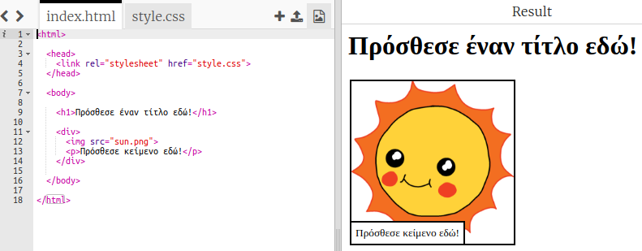
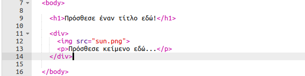
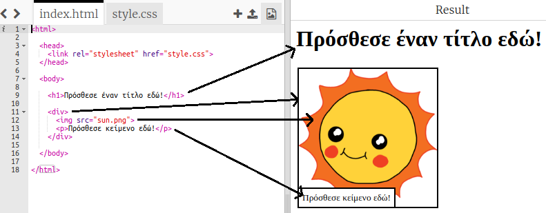

## Επεξεργασία της ιστορίας σου

Ας αρχίσουμε με την επεξεργασία του περιεχομένου HTML και του CSS στυλ της ιστοσελίδας της ιστορίας.

+ Άνοιξε [αυτό το trinket](https://trinket.io/html/552244ece0){:target="_blank"}.

Το έργο πρέπει να μοιάζει έτσι:

Το περιεχόμενο της ιστοσελίδας εισάγεται στην `<body>` ενότητα του `index.html` HTML εγγράφου.

+ Βρες το περιεχόμενο της ιστοσελίδας από τη γραμμή 7 και μετά, ανάμεσα στις ετικέτες `<body>` και `</body>`.

+ Δες αν μπορείς να ξεχωρίσεις ποιες ετικέτες χρησιμοποιούνται για τη δημιουργία των διαφόρων τμημάτων της ιστοσελίδας.

--- collapse ---
---
title: Απάντηση
---

+ `<h1>` είναι μια **επικεφαλίδα**. Μπορείς να χρησιμοποιήσεις τους αριθμούς 1 έως 6 για να δημιουργήσεις επικεφαλίδες διαφορετικών μεγεθών.
+ `
` είναι συντόμευση για την **διαίρεση**, και είναι ένας τρόπος ομαδοποίησης στοιχείων. Σε αυτή την ιστοσελίδα, θα το χρησιμοποιήσεις για να ομαδοποιήσεις όλα τα στοιχεία για κάθε μέρος της ιστορίας σου.
+ `` είναι μια **εικόνα**.
+ `
` είναι μια **παράγραφος** του κειμένου.

--- /collapse ---