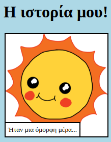

\--- challenge \---

## Πρόκληση: κάνε μερικές αλλαγές

Επεξεργάσου τον κώδικα HTML και CSS για να προσαρμόσεις την ιστοσελίδα σου.

Το περιεχόμενο HTML μπορεί να βρεθεί στο αρχείο `index.html`, και το CSS στυλ στο αρχείο `style.css`.

Μπορείς επίσης να αλλάξεις τα χρώματα που χρησιμοποιούνται στην ιστοσελίδα, και μπορείς να χρησιμοποιήσεις διαφορετικές γραμματοσειρές όπως:

+ Arial
+ Comic Sans MS
+ Impact
+ Tahoma

Βρες περισσότερα CSS ονόματα χρωμάτων [εδώ](http://jumpto.cc/colours){:target="_blank"}.

\--- /challenge \---