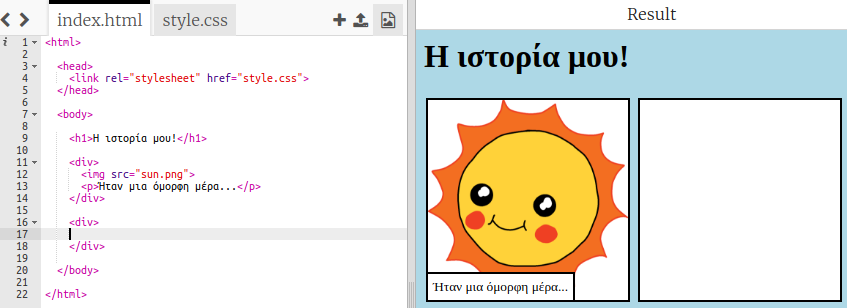
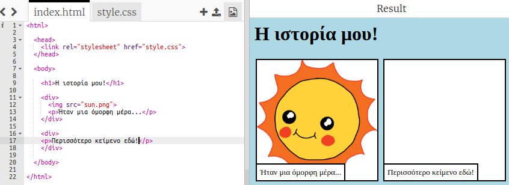
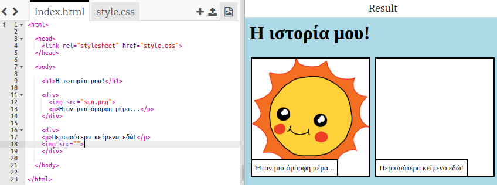

## Αφήγηση της ιστορίας σου

Ας προσθέσουμε ένα δεύτερο μέρος στην ιστορία σου.

+ Πήγαινε στη γραμμή 15 του κώδικα και πρόσθεσε ένα άλλο ζευγάρι ετικετών `<div>` και `</div>` αρχής και τέλους. Αυτό θα δημιουργήσει ένα νέο πλαίσιο για το επόμενο μέρος της ιστορίας σου.



+ Πρόσθεσε μια παράγραφο κειμένου μέσα στη νέα ετικέτα `<div>`:

```html
<p>Περισσότερο κείμενο εδώ!</p>
```



+ Μπορείς να εμφανίσεις μια εικόνα στο νέο σου πλαίσιο προσθέτοντας αυτόν τον κώδικα μέσα στην ετικέτα `<div>`:

```html

```



Παρατήρησε ότι οι ετικέτες `` διαφέρουν λίγο από τις άλλες ετικέτες: δεν έχουν ετικέτα τέλους.

+ Για να εμφανίσεις μια εικόνα, θα πρέπει να προσθέσεις την **προέλευση** (`src`) της εικόνας μέσα στα διπλά εισαγωγικά.

Κάνε κλικ στο εικονίδιο εικόνας για να δεις τις διαθέσιμες εικόνες για την ιστορία σου.


+ Διάλεξε ποια εικόνα θέλεις να προσθέσεις και θυμήσου το όνομά της, για παράδειγμα `buildings.png`.

+ Κάνε κλικ στο `index.html` για να επιστρέψεις στον κώδικά σου.


+ Γράψε το όνομα της εικόνας εντός των διπλών εισαγωγικών στην ετικέτα ``.

```html

```

