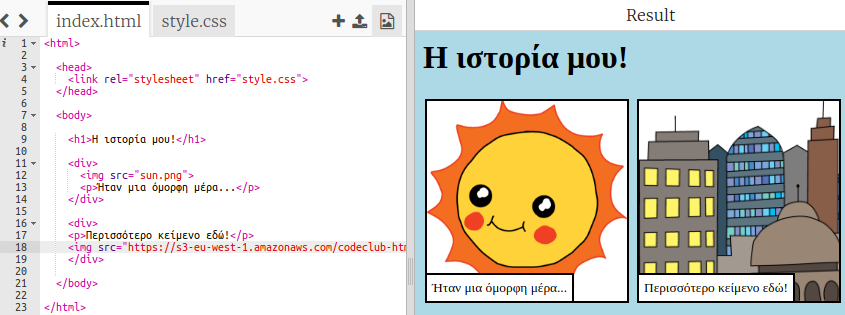

## Βρες τις δικές σου εικόνες

Ας βρούμε μια εικόνα στον ιστό για να προσθέσεις στην ιστορία σου.

+ Πήγαινε σε [αυτή τη σελίδα](http://jumpto.cc/html-images){:target="_blank"} και βρες μια εικόνα που θέλεις να συμπεριλάβεις στην ιστορία σου.

+ Κάνε δεξί κλικ στην εικόνα και κλικ στην επιλογή **Αντιγραφή διεύθυνσης URL εικόνας** (ή **Αντιγραφή διεύθυνσης εικόνας**, ανάλογα με τον υπολογιστή που χρησιμοποιείς). Η διεύθυνση URL είναι η διεύθυνση της εικόνας.

+ Πήγαινε πίσω στη σελίδα σου `index.html`.

+ Επικόλλησε τη διεύθυνση URL εντός των διπλών εισαγωγικών στην ετικέτα ``. Θα πρέπει να δεις την εικόνα να εμφανίζεται!

