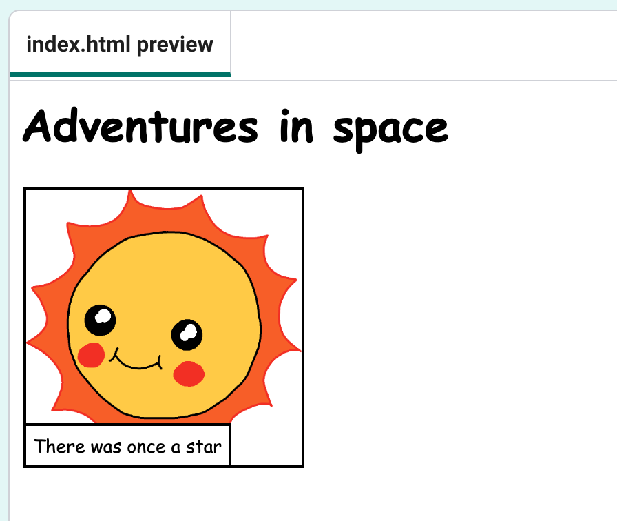

## Editing your story

--- task ---
Before you get coding, you'll need to decide on a story. Think about the story you want to tell. It could be:

+ A famous story
+ A story you have made up
+ Something that has happened to you or someone you know

It doesn't even have to be a story. It could be a joke, a poem, or anything else you want!
--- /task ---

--- task ---

Open the [starter project](https://editor.raspberrypi.org/en/projects/tell-a-story-starter){:target="_blank"}

--- /task ---

Webpage content goes in the `<body>` section of the `index.html` HTML document.

--- task ---

Change `My story` to the title of your story.

--- /task ---

--- task ---

Change `Add your own text here!` to the first line of your story

--- /task ---

--- task ---

Click **Run** to see your web page

--- /task ---