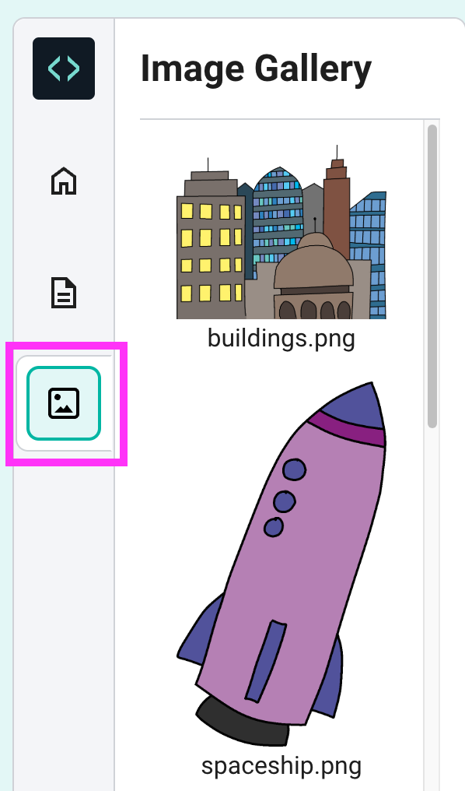
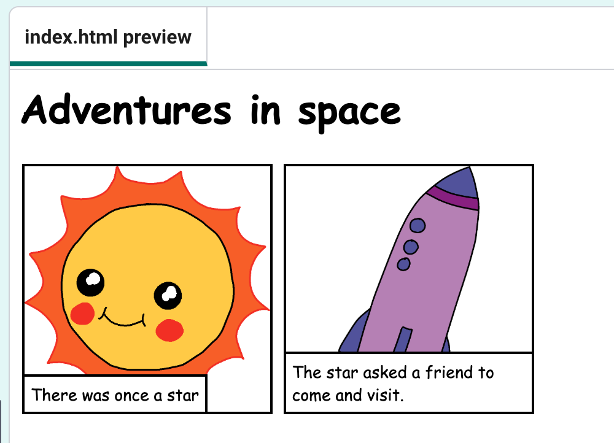

## Telling your story

Let's add a second part to your story.

--- task ---
Go to line 15 of the code, and add in another set of `
` and `
` start and end tags. This will create a new box for the next part of your story.

--- code ---
---
language: html
line_numbers: true
line_number_start: 15
line_highlights: 15-17
---

--- /code ---

--- /task ---

--- task ---

Add the code for an image `` tag:

--- code ---
---
language: html
line_numbers: true
line_number_start: 15
line_highlights: 16
---

--- /code ---

--- /task ---

--- task ---
Click on the images tab and choose one of the images. 

Make a note of the name of the image, for example `buildings.png` or `spaceship.png`.

--- /task ---

--- task ---

Add the name of the image inside the `` tag:

--- code ---
---
language: html
line_numbers: true
line_number_start: 15
line_highlights: 16
---

--- /code ---

--- /task ---

--- task ---
Add a `
` paragraph tag inside your new `
` tag, and write the next part of your story:

--- code ---
---
language: html
line_numbers: true
line_number_start: 15
line_highlights: 17
---

The star asked a friend to come and visit.

--- /code ---

--- /task ---

--- task ---

Press **Run** to see the next part of your story appear.

--- /task ---

--- task ---
Now, follow the same steps to add as many boxes as you need to finish your story.
--- /task ---