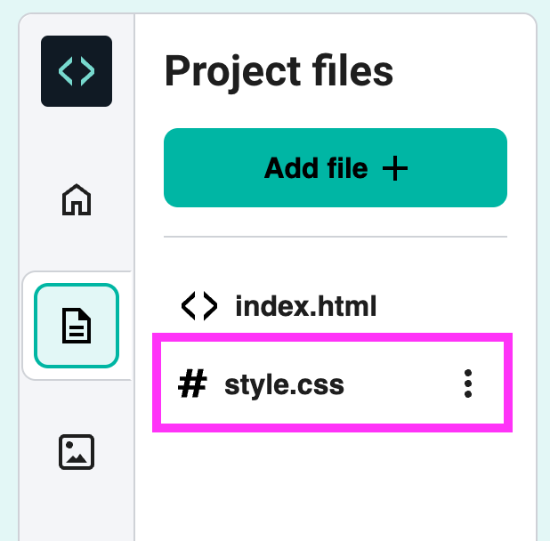

## Challenge

--- challenge ---

Edit the CSS code to customise your webpage. 

--- task ---
Click on the file `style.css`:

--- /task ---

--- task ---
Find the style for the body, and change the font. 

You can choose different fonts such as:
+ Arial
+ Impact
+ Tahoma

--- code ---
---
language: css
line_numbers: true
line_number_start: 1
line_highlights: 3
---
body {
  background-color: white;
  font-family: Comic Sans MS;
}
--- /code ---
--- /task ---

--- task ---
Change the background colour to a different colour:

--- code ---
---
language: css
line_numbers: true
line_number_start: 1
line_highlights: 2
---
body {
  background-color: white;
  font-family: Comic Sans MS;
}
--- /code ---

Find more CSS colour names [here](http://jumpto.cc/colours){:target="_blank"}.

--- /task ---

--- /challenge ---
