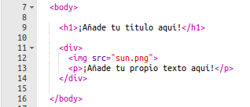
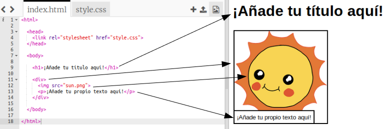

## Edita tu historia

Vamos a empezar editando el contenido HTML y los estilos CSS de la página web.

+ Abre este trinket: <a href="http://jumpto.cc/web-story" target="_blank">jumpto.cc/web-story</a>. Si estás leyendo esto en el navegador incluso podrías usar la versión embebida del Trinket que verás abajo.

<iframe src="https://trinket.io/embed/html/8083cfebb3" width="100%" height="400" frameborder="0" marginwidth="0" marginheight="0" allowfullscreen></iframe>

+ También debes recordar del proyecto 'Cumpleaños feliz' que el contenido de la página web va en el `<body>` del documento HTML.

	Ve a la línea 7 del código y deberías ver el contenido de la página web, que está entre las etiquetas de `<body>` y `</body>`.

	

+ ¿Podrías decir que etiquetas se usan para crear las distintas partes de la página web?

	

	+ `<h1>` es una __cabecera__. Puedes usar los números del 1 al 6 para los distintos tamaños de cabecera;
	+ `
` es la abreviatura de __division__, y es la manera de agrupar cosas juntas. En esta página web se usará para agrupar todo el contenido de tu historia;
	+ `` es una __imagen__;
	+ `
` es un __parrafo__ de texto.
