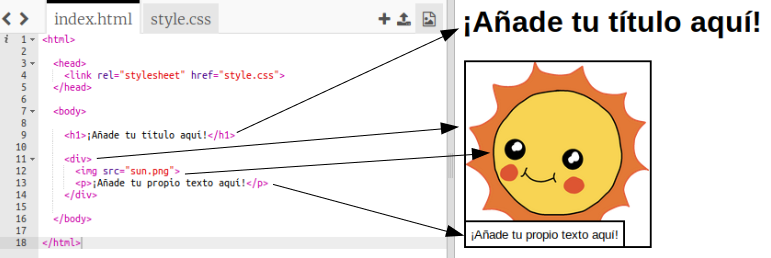

## Editando tu historia

Empecemos por editar el contenido HTML y el estilo CSS de la página web de la historia.

+ Abre [este trinket](http://jumpto.cc/web-story){:target="_blank"}.

El proyecto debe verse así:

El contenido de la página web va en la `<body>`sección del documento HTML `index.html`.

+ Encuentra el contenido de la página web a partir de la línea 7, dentro de las etiquetas `<body>` y ` </body>`.

+ Fíjate si puedes averiguar qué etiquetas se utilizan para crear las diferentes partes de la página web.

## \--- collapse \---

## title: Respuesta

+ `<h1>` es un encabezado ** **. Puedes usar los números del 1 al 6 para crear encabezados de diferentes tamaños.
+ `
` es la abreviatura de **division**, y es una forma de agrupar cosas. En esta página web, la usarás para agrupar todas las cosas de cada parte de tu historia.
+ ``es **image**, una imagen.
+ `
`es un **paragraph**, un párrafo de texto.

\--- /collapse \---