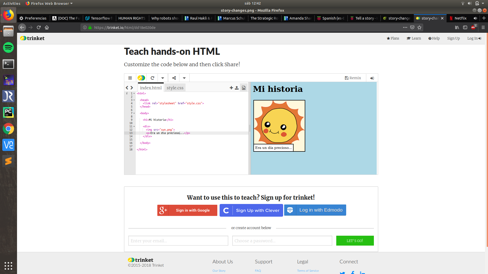

--- challenge ---
## Desafío: Haz algunos cambios 
Edita el código HTML y CSS para personalizar tu página web.

Puedes modificar los colores de la página web y también puedes elegir que fuentes utilizar como por ejemplo, Arial, Comic Sans MS, Impact y Tahoma.

Si necesitas más ayuda mira el proyecto 'Cumpleaños feliz'.

--- /challenge ---
