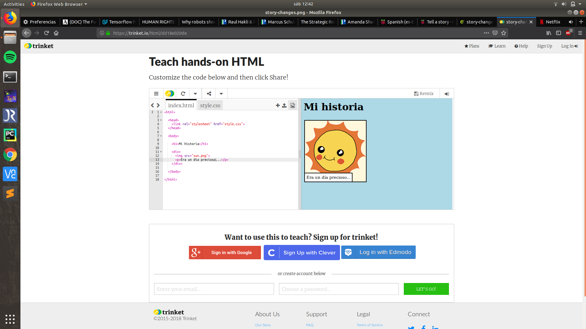

--- challenge ---

## Desafío: haz algunos cambios

Edita el código HTML y CSS para personalizar tu página web.

El contenido HTML se puede encontrar en el archivo `index.html`, y el estilo CSS en el archivo `style.css`.

También puedes cambiar los colores utilizados en la página web, y puedes usar diferentes tipos de letras como:

+ Arial
+ Comic Sans MS
+ Impact
+ Tahoma

Puedes encontrar más nombres de colores de CSS [aquí](http://jumpto.cc/colours){:target="_ blank"}.

--- /challenge ---