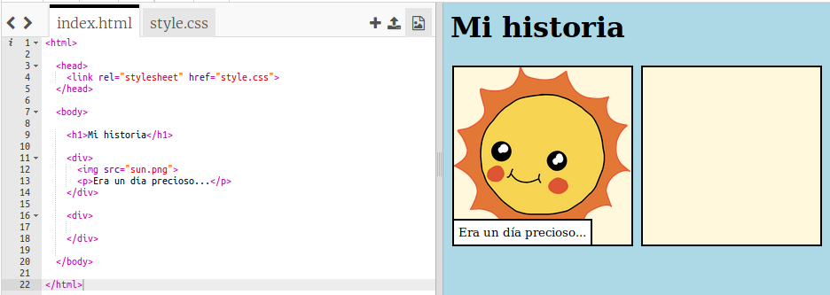

## Contando tu historia

Vamos a añadir una seguna parte a tu historia.

+ Ve a la línea 17 del código y añade un par de etiquitas `<div>` y `</div>`. Esto creará una nueva viñeta para la siguiente parte de tu historia.

	

+ Añade un parrafo de texto dentro de tus etiquetas `<div>`.

	

+ Finalmente puedes añadir una imagen en tu nueva viñeta. Para eso añade el siguiente código dentro de tu etiqueta `<div`:

	```
	
	```

	Fíjate que la etiqueta `` es un poco diferente que el resto de las etiquetas, esta no tiene etiqueta de fin.

+ Para las imágenes HTML necesitas añadir la __fuente__ de la imagen entre las comillas. Vamos a buscar una imagen para añadirla a tu historia.

	Ve a <a href="http://jumpto.cc/web-images" target="_blank">jumpto.cc/web-images</a>, y busca la imagen que quieras incluir en la historia.

+ Haz click sobre el botón derecho sobre la imagen y pincha en 'Copiar la url de la imagen'. La URL es la dirección de la imagen.

	

+ Pega la URL entre las comillas de tu etiqueta ``. ¡Deberías ver aparecer tu imagen!

	

+ __Si tienes una cuenta en Trinket__, incluso podrías añadir tu propias imágenes a tu página web! Para hacer esto, pincha el icono de imagen y después pincha en el botón de 'subir'.

	

+ Busca una imagen de tu ordenador y añadela al trinket.

	

+ Basta con que añadas el nombre de tu imagen entre las comillas de la etiqueta ``, de esta manera:

	```
	
	```
