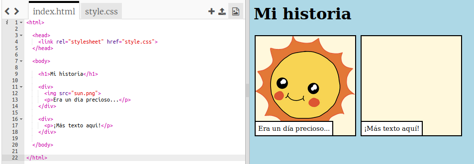
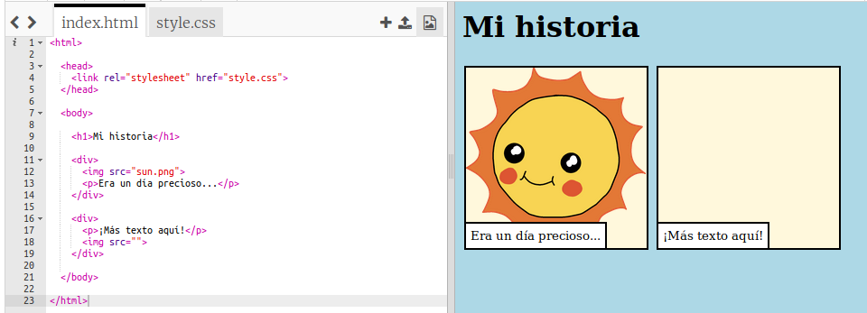
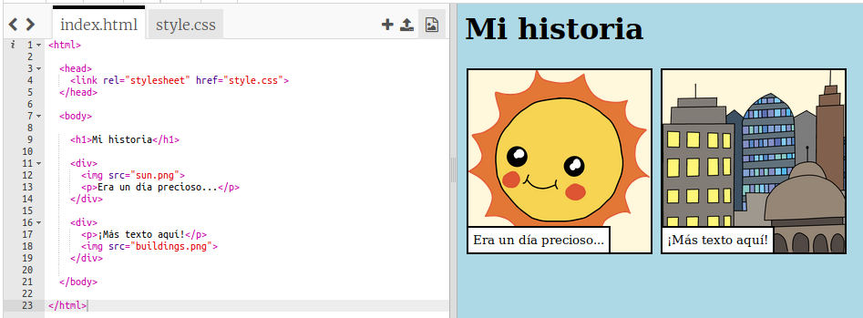

## Cuenta tu historia

Agreguemos una segunda parte a tu historia.

+ Ve a la línea 15 del código y agrega otro conjunto de etiquetas `<div>` y ` </div>` de inicio y finalización. Esto creará una nueva caja para la siguiente parte de tu historia.


+ Agrega un párrafo de texto dentro de tu nueva etiqueta `<div>`:

```html
<p>¡Más texto aquí!</p>
```



+ Puedes mostrar una imagen en tu nueva caja agregando este código dentro de tu etiqueta `<div>`:

```html

```



Ten en cuenta que las etiquetas `` son un poco diferentes a otras etiquetas: no tienen una etiqueta final.

+ Para que aparezca una imagen, debes agregar el **origen** (`src`) de la imagen dentro de las comillas.

Haz clic en el icono de imagen para ver las imágenes disponibles para tu historia.


+ Decide qué imagen deseas agregar y recuerda su nombre, por ejemplo, `buildings.png`.

+ Haz clic en `index.html` para volver a tu código.


+ Agrega el nombre de la imagen entre las comillas en tu etiqueta ``.

```html

```

