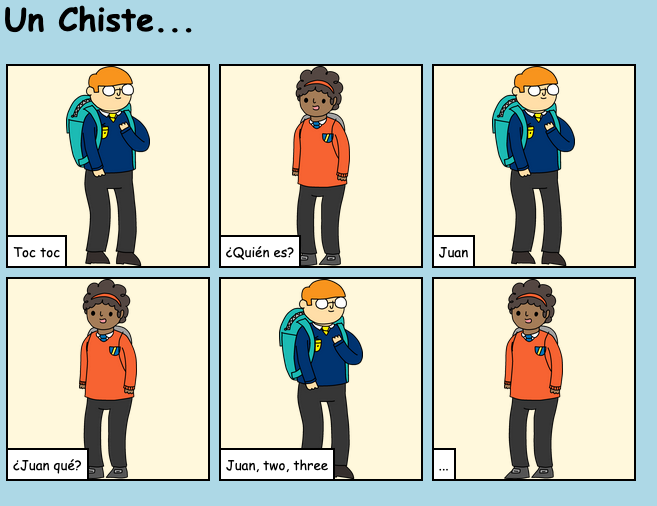

## Introducción

En este proyecto, aprenderás cómo crear tu propia página web para contar una historia, un chiste o un poema.

### Lo que harás

¡Desplázate hacia abajo en el trinket para leer el chiste!

  <iframe src="https://trinket.io/embed/html/c8afdef912?outputOnly=true&start=result" width="600" height="450" frameborder="0" marginwidth="0" marginheight="0" allowfullscreen>
  </iframe>
  

### Lo que aprenderás

This project covers elements from the following strands of the [Raspberry Pi Digital Making Curriculum](https://rpf.io/curriculum){:target="_blank"}:

+ [Diseño de elementos básicos en 2D y 3D ](https://www.raspberrypi.org/curriculum/design/creator) {: target = "_ blank"}.

### Información adicional para educadores

Si necesitas imprimir este proyecto, usa la [versión para imprimir](https://projects.raspberrypi.org/en/projects/tell-a-story/print){:target="_blank"} .

Usa el enlace en el pie de página para acceder al repositorio de GitHub para este proyecto, que contiene todos los recursos (incluyendo un ejemplo de un proyecto terminado) en la carpeta 'en/resources'.