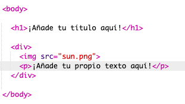
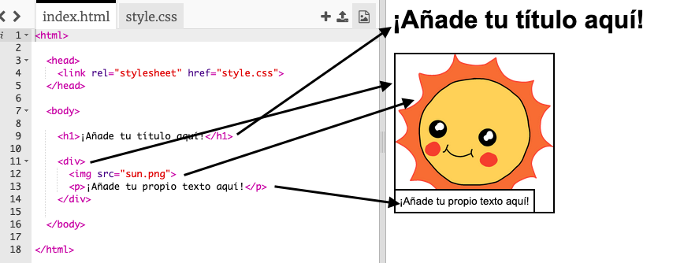

## Editando tu historia

Empecemos por editar el contenido HTML y el estilo CSS de la página web de la historia.

+ Abre [este trinket](http://jumpto.cc/web-story){:target="_blank"}.

El proyecto debe verse así:

El contenido de la página web va en la sección `<body>` del documento HTML `index.html`.

+ Find the webpage content from line 7 onwards, inside `<body>` and `</body>` tags.

+ Fíjate si puedes averiguar qué etiquetas se utilizan para crear las diferentes partes de la página web.

## \--- collapse \---

## title: Respuesta

+ # es un **heading (encabezado)**. Puedes usar los números del 1 al 6 para crear encabezados de diferentes tamaños.</li> 
    
    + 

          es la abreviatura de <strong>division</strong>, y es una forma de agrupar cosas. En esta página web, la usarás para agrupar todas las cosas de cada parte de tu historia.</li> 
          
          <li>
            es <strong>image</strong>, una imagen.
          </li>
          
          <li>
            

              es un <strong>paragraph</strong>, un párrafo de texto.</li> </ul> 
              
              

                --- /collapse ---
              
