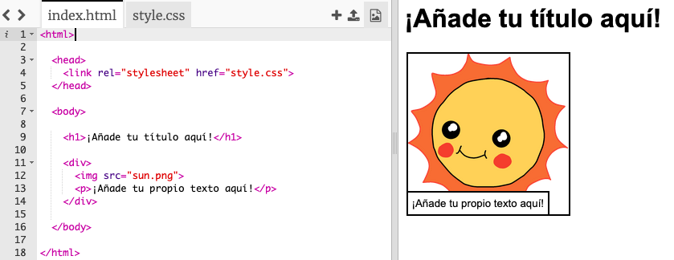

## Editando tu historia

Empecemos por editar el contenido HTML y el estilo CSS de la página web de la historia.

+ Abre [este trinket](http://jumpto.cc/web-story){:target="_blank"}.

El proyecto debe verse así:

El contenido de la página web va en la sección `<body>` del documento HTML `index.html`.

+ Encuentra el contenido de la página web a partir de la línea 7, dentro de las etiquetas `<body>` y ` </body>`.

+ Fíjate si puedes averiguar qué etiquetas se utilizan para crear las diferentes partes de la página web.

## \--- collapse \---

## title: Respuesta

+ # es un **heading (encabezado)**. Puedes usar los números del 1 al 6 para crear encabezados de diferentes tamaños.</li> 
    
    + `
` is short for **division**, and is a way of grouping stuff together. In this webpage, you'll use it to group together all the stuff for each part of your story.
    + es **image**, una imagen.
    + `
` is a **paragraph** of text.</ul> 
    
    \--- /collapse \---