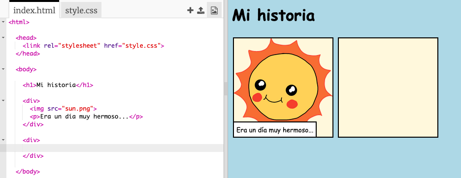
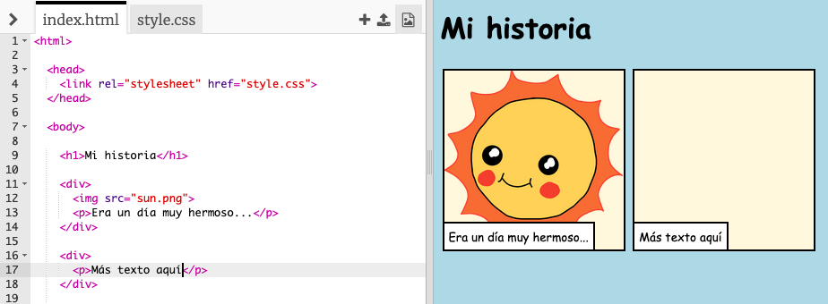
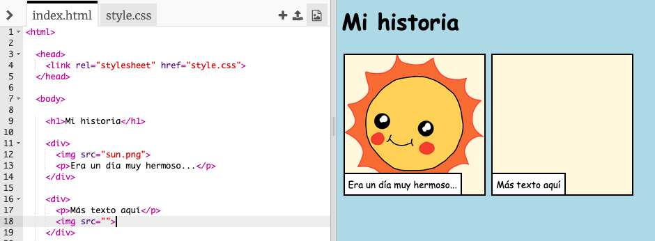
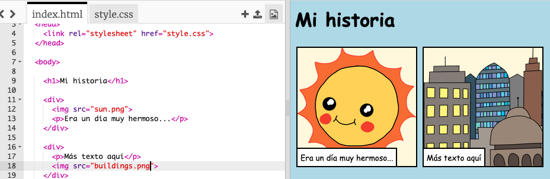

## Telling your story

Agreguemos una segunda parte a tu historia.

+ Ve a la línea 15 del código y agrega otro conjunto de etiquetas `<div>` y ` </div>` de inicio y finalización. Esto creará una nueva caja para la siguiente parte de tu historia.



+ Add a paragraph of text inside your new `<div>` tag:

```html
<p>¡Más texto aquí!</p>
```



+ Puedes mostrar una imagen en tu nueva caja agregando este código dentro de tu etiqueta <div>
      :</li> </ul> 
      
      <pre><code class="html">&lt;img src=""&gt;
</code></pre>
      
      <p>
        
      </p>
      
      <p>
        Ten en cuenta que las etiquetas  son un poco diferentes a otras etiquetas: no tienen una etiqueta final.
      </p>
      
      <ul>
        <li>
          To get an image to show up, you need to add the <strong>source</strong> (<code>src</code>) of the image inside the speech marks.
        </li>
      </ul>
      
      <p>
        Haz click en el icono de imagen para ver las imágenes disponibles para tu historia.
      </p>
      
      <p>
        
      </p>
      
      <ul>
        <li>
          <p>
            Decide qué imagen deseas agregar y recuerda su nombre, por ejemplo, <code>buildings.png</code>.
          </p>
        </li>
        <li>
          <p>
            Haz click en <code>index.html</code> para volver a tu código.
          </p>
        </li>
      </ul>
      
      <p>
        
      </p>
      
      <ul>
        <li>
          Añade el nombre de la imagen entre las comillas en tu etiqueta .
        </li>
      </ul>
      
      <pre><code class="html">&lt;img src="buildings.png"&gt;
</code></pre>
      
      <p>
        
      </p>