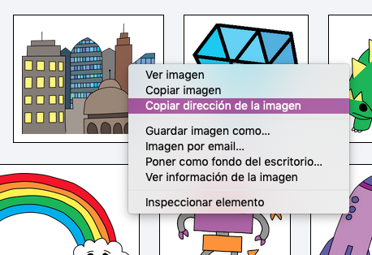
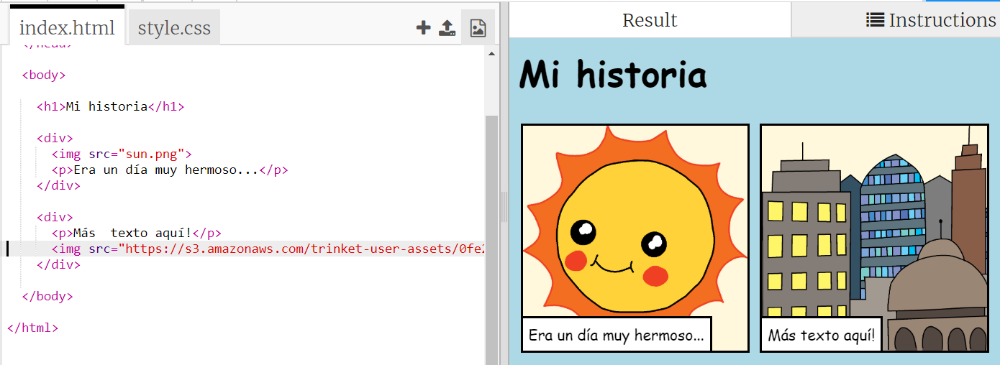

## Encontrando tus propias imágenes

Encontremos una imagen en la web para agregar a tu historia.

+ Ve a [esta página](http://jumpto.cc/html-images){:target="_blank"}, y encuentra una imagen que quieras incluir en tu historia.

+ Haz click derecho en la imagen y haz click en **Copiar URL de la imagen** (o **Copiar dirección de imagen**, dependiendo del ordenador que estés usando). La URL es la dirección de la imagen.

+ Vuelve a tu página `index.html`.

+ Pega la URL entre las comillas en tu etiqueta ``. ¡Tu imagen debería aparecer!

