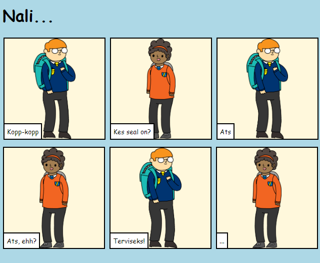

## Sissejuhatus

Selles projektis saad teada, kuidas oma veebilehte luua, et rääkida lugu, nali või luuletus.

### Mida sa teed

Keri trinketis alla, et näha lõppu!

  <iframe src="https://trinket.io/embed/html/c2b8ff5ee7?outputOnly=true&start=result" width="600" height="450" frameborder="0" marginwidth="0" marginheight="0" allowfullscreen>
  </iframe>
  

### Mida sa õpid

Selles projektis käsitletakse elemente [Raspberry Pi digitaalse tegemise õppekava](http://rpf.io/curriculum){:target="_blank"} järgmistest valdkondadest:

+ [Disaini põhilisi 2D- ja 3D-varasid](https://www.raspberrypi.org/curriculum/design/creator){:target="_blank"}.

### Lisainfo õpetajatele

Kui sul on vaja see projekt välja printida, siis kasuta [printerisõbralikku versiooni](https://projects.raspberrypi.org/et-EE/projects/tell-a-story/print){:target="_blank"}.

Kasuta linki jaluses, et pääseda ligi selle projekti GitHub varamule, mis sisaldab kõiki ressursse (kaasa arvatud valmisprojekti näidist) 'en/resources' kaustas.