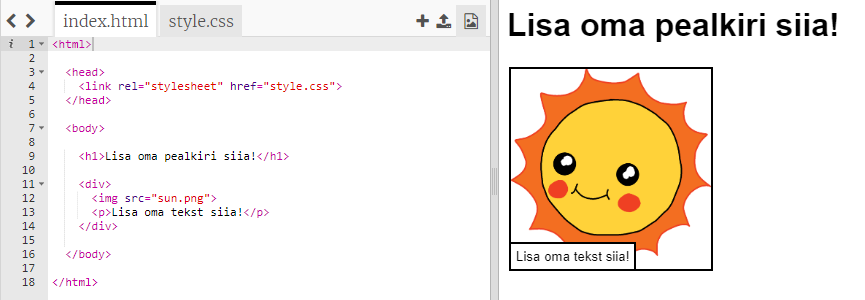
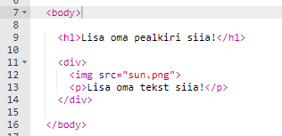
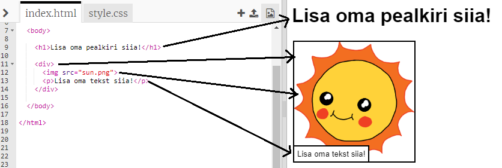

## Oma loo muutmine

Alustame loo veebilehe HTML-sisu ja CSS-stiili muutmisega.

+ Ava [see trinket](http://jumpto.cc/web-story){:target ="_blank"}.

Projekt peaks välja nägema selline:

Veebilehe sisu läheb `<body>` jaotisesse `index.html` HTML-dokumendis.

+ Veebilehe sisu leiad alates 7. reast, `&lt;body&gt;` ja `&lt;/body&gt;` siltide seest.

+ Vaata, kas suudad välja mõelda, milliseid silte veebilehe erinevate osade loomiseks kasutatakse.

## \--- collapse \---

## title: Vastus

+ `&lt;h1&gt;` on **pealkiri**. Võid kasutada numbreid 1 kuni 6 erisuuruste pealkirjade loomiseks.
+ `&lt;div&gt;` on lühend **jaotamisele**ja see on moodus asjade rühmitamiseks. Sellel veebilehel saad seda kasutada, et rühmitada kõik asjad oma loo iga osa jaoks.
+ `&lt;img&gt;` on **kujutis**.
+ `&lt;p&gt;` on teksti **lõik**.

\--- /collapse \---